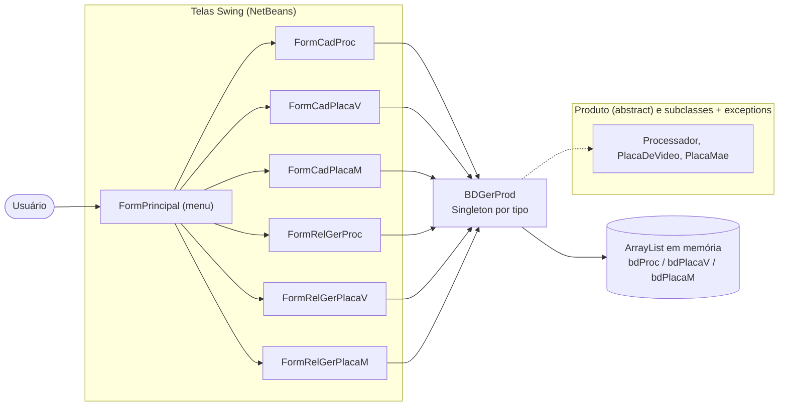
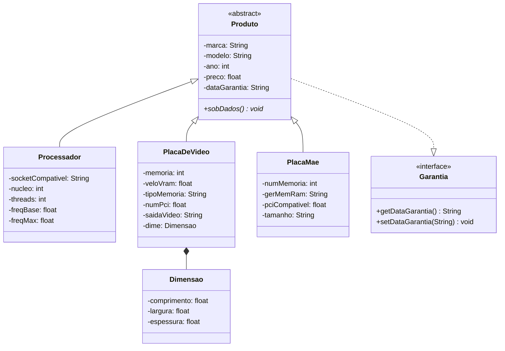

#  Sistema de Cadastro de Componentes de Hardware (versão em memória)

Aplicação desktop em Java para gerenciamento de estoque de componentes de hardware (processadores, placas de vídeo e placas-mãe), com persistência **em memória** (sem banco de dados). Primeira etapa de um projeto acadêmico focado em lógica de programação e Orientação a Objetos, evoluído posteriormente para uma versão com MySQL.


-orange?style=flat)


## Sumário

- [Visão Geral](#visão-geral)
- [Funcionalidades](#funcionalidades)
- [Arquitetura](#arquitetura)
- [Modelo de Dados](#modelo-de-dados)
- [Tecnologias](#tecnologias)
- [Como Executar](#como-executar)
- [Fluxo de Uso](#fluxo-de-uso)
- [Regras de Negócio](#regras-de-negócio)
- [Estrutura de Pastas](#estrutura-de-pastas)
- [Limitações e Observações](#limitações-e-observações)
- [Evolução do Projeto](#evolução-do-projeto)
- [Criador](#criador)
- [Licença](#licença)

## Visão Geral

Esta é a primeira versão do sistema de cadastro de componentes de hardware — processadores, placas de vídeo e placas-mãe — construída **sem banco de dados**: todos os registros ficam guardados em listas em memória enquanto a aplicação está aberta, e se perdem ao fechá-la. O objetivo do projeto foi praticar lógica de programação, Orientação a Objetos (herança, polimorfismo) e construção de interface gráfica no NetBeans, antes de introduzir persistência real.

Cada tipo de componente tem sua própria tela de cadastro (CRUD completo) e sua própria tela de relatório. Não há tela de login nem listagem unificada entre os três tipos — cada um é gerenciado de forma independente.

## Funcionalidades

**Cadastro de Componentes** (uma tela por tipo, com os botões Cadastrar / Consultar / Alterar / Remover)
- **Processador** — marca, modelo, ano, preço, socket compatível, núcleos, threads, frequência base e máxima
- **Placa de Vídeo** — marca, modelo, ano, preço, memória (GB), velocidade da VRAM, tipo de memória, versão do PCI, saída de vídeo e dimensões físicas
- **Placa-Mãe** — marca, modelo, ano, preço, número de canais de memória, geração de RAM suportada, versão do PCI compatível e tamanho do formato

**Alteração via caixas de diálogo**
- A opção "Alterar" não reedita o formulário inteiro: abre caixas de diálogo (`JOptionPane`) sequenciais para atualizar apenas **preço** e **data de garantia** do item já cadastrado

**Relatórios**
- Uma tela de relatório por tipo de componente, listando os itens daquele tipo em uma `JTable`, lida diretamente da lista em memória

## Arquitetura



Não existe camada de acesso a dados nem conexão externa: a classe `BDGerProd` concentra as regras de cadastro, consulta, alteração e remoção diretamente sobre `ArrayList`s mantidas em memória, seguindo um padrão Singleton — uma instância dedicada para cada tipo de componente (`gerGerProc()`, `gerGerPlacaV()`, `gerGerPlacaM()`).

## Modelo de Dados

Como não há banco de dados, o "modelo de dados" é definido apenas pelas classes Java — sem chaves primárias, sem relações formais entre tabelas:



Assim como nas subclasses, consultas, atualizações e remoções em `BDGerProd` são feitas comparando **marca + modelo** (não há um `id` numérico).

## Tecnologias

| Tecnologia | Versão | Função |
|---|---|---|
| Java | 18 | Linguagem e ambiente de execução |
| Swing | — | Interface gráfica (telas geradas no NetBeans GUI Builder) |
| Maven | — | Build e gerenciamento do projeto (`pom.xml`) |

Não há banco de dados, ORM, nem qualquer dependência externa listada no `pom.xml` — o projeto roda apenas com a JDK e as bibliotecas padrão do Swing.

## Como Executar

### Pré-requisitos

- JDK 18
- NetBeans IDE (recomendado, pela dependência dos arquivos `.form`) ou Maven na linha de comando

### Opção 1 — NetBeans (recomendado)

1. Abra o projeto no NetBeans (`File > Open Project`)
2. Rode o projeto (`Run > Run Project` ou F6) — a classe de entrada é `FormPrincipal`

### Opção 2 — Linha de comando

```bash
mvn compile
mvn exec:java -Dexec.mainClass="FormPrincipal"
```

> ⚠️ O `pom.xml` define `exec.mainClass` como `Projeto`, uma classe que não existe no projeto — por isso é preciso sobrescrever o mainClass manualmente com `-Dexec.mainClass="FormPrincipal"` ao rodar via linha de comando.

## Fluxo de Uso

1. **Menu Principal** (`FormPrincipal`) — acesso direto, sem login
2. **Cadastro** — abre a tela do tipo de componente escolhido, com Cadastrar / Consultar / Alterar / Remover
3. **Alterar** — em vez de reabrir o formulário preenchido, dispara caixas de diálogo sequenciais para trocar preço e garantia do item encontrado
4. **Relatório** — lista, em uma tabela, todos os itens daquele tipo cadastrados na sessão atual

## Regras de Negócio

As mesmas validações de domínio da versão com banco de dados se aplicam aqui, já que as classes de modelo são idênticas:

- **Ano** — produtos anteriores a 2015 são rejeitados
- **Preço** — deve ser maior que zero
- **Marca** — validada contra uma lista fixa por tipo de componente (ex: processador aceita apenas `INTEL` ou `AMD`)
- **Modelo (Processador)** — precisa ser compatível com a marca (ex: AMD só aceita modelos começando com `RYZEN`, `ATHLON`, `A12` etc.)
- **Socket (Processador)** — restrito por marca (`LGA 1151/1155/1200/1700` para Intel; `AM4`/`AM5` para AMD)
- **Núcleos e Threads (Processador)** — maiores que zero, com threads ≥ núcleos
- **Frequência base e máxima (Processador)** — maiores que zero, com máxima ≥ base
- **Geração de RAM (Placa-Mãe)** — restrita a `DDR3`, `DDR4` ou `DDR5`
- **PCI compatível (Placa-Mãe / Placa de Vídeo)** — restrito a `3.0`, `4.0` ou `5.0`
- **Tamanho (Placa-Mãe)** — restrito a `EATX`, `ATX`, `MICRO-ATX` ou `MINI-ATX`
- **Tipo de memória (Placa de Vídeo)** — restrito a `GDDR4` até `GDDR7`
- Um mesmo componente (mesma marca + modelo) não pode ser cadastrado duas vezes — `cadProc`/`cadPlacaV`/`cadPlacaM` verificam duplicidade antes de inserir

## Estrutura de Pastas

```
java-crud-desktop/
├── src/main/java/
│   ├── BDGerProd.java              # "Banco" em memória (Singleton por tipo, CRUD via ArrayList)
│   ├── Produto.java                 # Classe abstrata base
│   ├── Processador.java
│   ├── PlacaDeVideo.java
│   ├── PlacaMae.java
│   ├── Dimensao.java                # Usado em PlacaDeVideo
│   ├── Garantia.java                # Interface do campo de garantia
│   ├── *Exception.java              # Uma exception por regra de validação
│   ├── FormPrincipal.*              # Menu principal / classe de entrada
│   ├── FormCadProc.* / FormCadPlacaV.* / FormCadPlacaM.*   # Telas de cadastro (CRUD)
│   └── FormRelGerProc.* / FormRelGerPlacaV.* / FormRelGerPlacaM.*  # Relatórios por tipo
├── pom.xml                          # Build Maven
├── nbactions.xml                    # Ações de build/run do NetBeans
└── nb-configuration.xml
```

## Limitações e Observações

- Persistência apenas em memória — todos os dados são perdidos ao fechar a aplicação
- Sem chave primária: identificação sempre por marca + modelo
- A edição ("Alterar") só permite trocar preço e garantia; os demais campos não são editáveis após o cadastro
- `BDGerProd` cria uma instância Singleton separada para cada tipo de componente — funciona porque cada tela usa consistentemente o getter correspondente ao seu tipo (`gerGerProc()`, `gerGerPlacaV()` ou `gerGerPlacaM()`), mas é um uso pouco convencional do padrão Singleton (o esperado seria uma única instância compartilhando as três listas)
- `pom.xml` referencia uma classe principal (`Projeto`) que não existe no código-fonte

## Evolução do Projeto

Este projeto evoluiu para uma versão com persistência real em banco de dados MySQL:

👉 https://github.com/Yakino41/java-crud-mysql

## Criador

**Arthur Gabriel Teotonio Stellato**
[GitHub](https://github.com/Yakino41)

## Licença

Projeto desenvolvido para fins acadêmicos.
